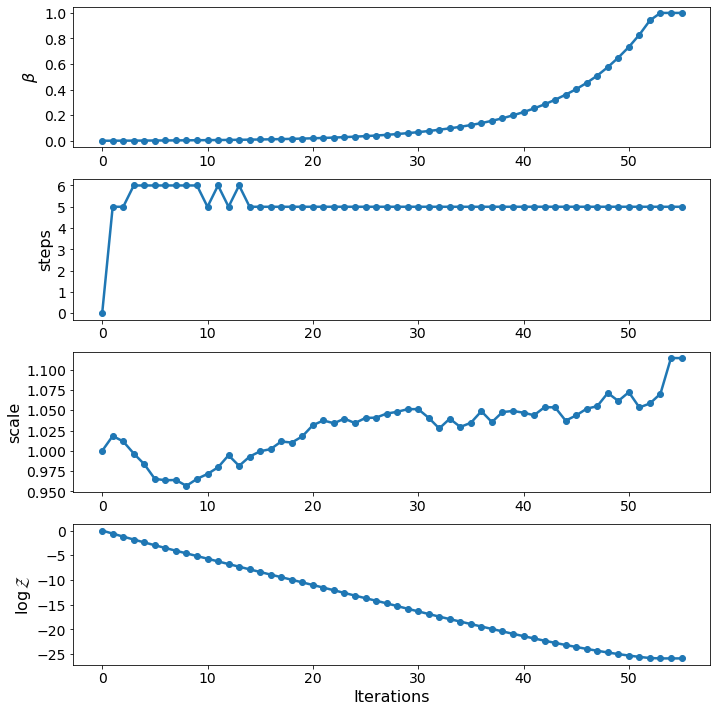
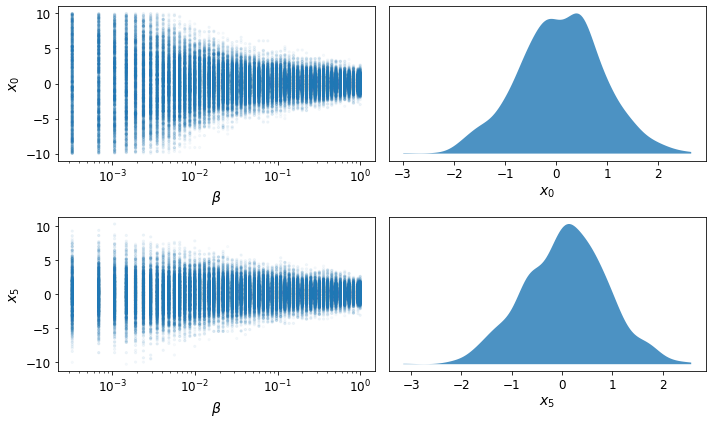
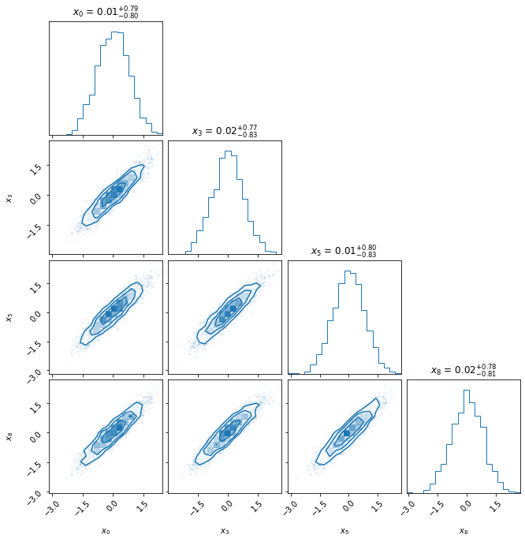

.. _advanced:

==============
Advanced Guide
==============

This guide is intended to give the user an idea of the various options and possibilities available in `pocoMC`. 
We will start by explaining in detail how to define a problem of Bayesian inference. Then, we will demonstrate 
how to use `pocoMC` in order to solve the aforementioned problem as effectively and robustly as possible.

Defining the inference problem
==============================

We will begin by defining our problem. To this end we need to define *log-likelihood* function :math:`\log\mathcal{L}(\theta)=\log p(d\vert\theta,\mathcal{M})` and 
*log-prior* probability density function :math:`\log \pi(\theta) = \log p(\theta\vert \mathcal{M})`. We will start with the former, the likelihood.
If you are not familiar with these terms I encourage you to visit the :doc:`background` section for some theory. 

Log-likelihood function
-----------------------
Suppose that we want our *likelihood* function to be a *Gaussian density* with 10 paramerers or in 10-D, we would do 
something like::

    import numpy as np

    # Define the dimensionality of our problem.
    ndim = 10

    # Define our 3-D correlated multivariate normal log-likelihood.
    C = np.identity(ndim)
    C[C==0] = 0.95
    Cinv = np.linalg.inv(C)
    lnorm = -0.5 * (np.log(2 * np.pi) * ndim + np.log(np.linalg.det(C)))

    def loglike(x):
        return -0.5 * np.dot(x, np.dot(Cinv, x)) + lnorm

The inclusion of the normalisation factor `lnorm` is not strictly necessary as it does not depend on `x` and thus does 
vary. 

Log-prior probability density function
--------------------------------------

The next step is to define the *log-prior* function. Suppose that we want our prior to be uniform :math:`x\sim\mathcal{U}(-10,10)`
in all 10 of the parameters. We can do this in Python as::

    def logprior(x):
        if np.any(x < -10.0) or np.any(x > 10.0):
            return - np.inf
        else:
            return - ndim * np.log(10.0)

Again, the normalisation term :math:`- ndim * np.log(10.0)` in the case that a point :math:`x` is inside the boundaries is not strictly
necessary, as it doesn't vary. Instead, it is common to return `0.0` in those cases.

If Instead we required a prior that is normal/*Gaussian* on all parameters with zero-mean and a standard deviation of `3.0`,
e.g. :math:`x\sim\mathcal{N}(0,3^{2})`, we would do something like::

    def logprior(x):
        return - 0.5 * np.dot(x, x) / 3.0**2.0

Alternatively, we can have priors in which not all of the paramerers have the same density a priori. For instance, suppose that 
we want the first five parameters to have a flat/uniform prior :math:`x_{i}\sim\mathcal{U}(-10,10)` for :math:`i=0,1,\dots,4` and
the last five to have a Gaussian/normal prior  :math:`x_{i}\sim\mathcal{N}(0,3^{2})` for :math:`i=5,6,\dots,9`, we would do::

    def logprior(x):
        if np.any(x[:5] < -10.0) or np.any(x[:5] > 10.0):
            return - np.inf
        else:
            return - 5 * np.log(10.0) - 0.5 * np.dot(x[5:], x[5:]) / 3.0**2.0

Parameter bounds
----------------

Furthermore, it is useful for `pocoMC` to know which parameters are bounded and how. This is often determined based on 
the form of the prior distribution. For instance, in the case of the prior that we just discussed, in which the first 5
of the parameters have a flat/uniform prior and the final five have a Gaussian/normal prior, we know the lower and upper 
bounds for the first five. 

We can define the lower and/or upper bounds for any parameter that we know and set `None` for the rest of them::

    bounds = np.empty((ndim, 2))
    bounds[:5, 0] = -10.0
    bounds[:5, 1] = 10.0
    bounds[5:] = None

If a parameter is only bounded from below or high we can only set that bound e.g. `bounds[i] = np.array([None, 10.0])`.

Preconditioned Monte Carlo with pocoMC
======================================

Having defined the Bayesian components of the problem (e.g. likelihood, prior, etc.) we can now turn our attention to
configuring `pocoMC` in order to solve this inference problem.

Initial particles
-----------------

The first step is generate some samples/points from the prior distribution. These will be the starting positions for the 
particles or walkers of `pocoMC`.

For instance, in the case of the half-uniform/half-normal prior that we discussed above, we can generate some prior samples as::

    nparticles = 1000

    prior_samples = np.empty((nparticles, ndim))
    prior_samples[:, :5] = np.random.uniform(low=-10.0, high=10.0, size=(nparticles, 5))
    prior_samples[:, 5:] = np.random.normal(loc=0.0, scale=3.0, size=(nparticles, 5))

Here we chose to use `nparticles = 1000` as the total number of particles. In real applications, we recommend to use at least this
many particles and possibly more if you expect your distribution to be particularly nasty (e.g. high dimensional :math:`D>10`, 
highly correlated, and/or multimodal).

Sampler initialisation
----------------------

The next step is to import `pocoMC` and initialise the `Sampler` class::

    import pocomc as pc

    sampler = pc.Sampler(nparticles = nparticles,
                         ndim = ndim,
                         loglikelihood = loglike,
                         logprior = logprior,
                         bounds = bounds,
                        )

Running the sampler
-------------------

Running the actual sampling procedure that will produce, among other things, a collection of samples from the posterior as well as 
an unbiased estimate of the model evidence, can be done by providing the `prior_samples` to the `run` method of the sampler::

    sampler.run(prior_samples)

Running the above also produces a progress bar similar to the one shown below::

    Iter: 6it [00:17,  3.18s/it, beta=0.00239, calls=35000, ESS=0.95, logZ=-3.52, accept=0.232, N=6, scale=0.964, corr=0.728] 

We can also use the `run` method to specify the desired *effective sample size (ESS)*, as well as the minimum and maximum number
of MCMC steps per iteration (the actual number is determined adaptively)::

    sampler.run(start = prior_samples,
                ess = 0.95,
                nmin = 5,
                nmax = 50
               )

The default choice for ESS is `ess = 0.95`, meaning :math:`95\%`. The allowed range for ESS is :math:`(0\%, 100\%)`. Values closer
to the upper limit result in slower but more careful sampling (and also better estimates of the model evidence). The default value
works well for most target distributions.

Adding more samples
-------------------

Once the main run has finished running, we can add more samples at the end of it. For instance, to add `2000` samples, we can do::

    sampler.add_samples(2000)

Results
-------

Once the run is complete and we have optionally added extra samples, it is time to look at the results. This can be done using the 
`results` dictionary, as follows::

    results = sampler.results

This is a dictionary which includes the following arrays:

1. **results['iter']** - Array with number iteration indeces (e.g. `np.array([0, 1, 2, ...])`)
2. **results['posterior_samples']** - Array with the **samples drawn from posterior**. This is usually what you need for parameter inference.
3. **results['posterior_logl']** - Array with the **values of the log-likelihood** for the posterior samples given by `results['posterior_samples']`.
4. **results['posterior_logp']** - Array with the **values of the log-prior** for the posterior samples given by `results['posterior_samples']`.
5. **results['samples']** - Array with the final samples from all the intermediate distributions.
6. **results['logl']** - Array with the values of the log-likelihood for the samples from all the intermediate distributions.
7. **results['logw']** - Array with the values of the log-weights for the samples from all the intermediate distributions.
8. **results['logz']** - Array with the evolution of the estimate of the **logarithm of the model evidence** :math:`\log\mathcal{Z}`. This is usually what you need for model comparison.
9. **results['ess']** - Array with the evolution of the ESS during the run.
10. **results['ncall']** - Array with the evolution of the number of log-likelihood calls during the run.
11. **results['beta']** - Array with the values of beta.
12. **results['accept']** - Array with the Metropolis-Hastings acceptance rates during the run.
13. **results['scale']** - Array with the evolution of the scale factor during the run.
14. **results['steps']** - Array with the number of MCMC steps per iteration during the run.

Visualising the results
-----------------------

First of all, we can plot the *run-plot* that shows us various metrics calculated during the run using the command::

    import matplotliib.pyplot as plt

    pc.plotting.run(results)
    plt.show()

We can also plot a *trace-plot* of the parameters, showing the marginal distribution for each parameter, as well as
its evolution during the run, by running::

    pc.plotting.trace(results, dims = [0, 5])
    plt.show()

where `dims = [0, 5]` selects only the 0th and 5th parameter to plot.

Finally, we can also produce a corner plot e.g. for parameters `dims = [0, 3, 5, 8]`, by running::

    pc.plotting.corner(results, dims = [0, 3, 5, 8])
    plt.show()

All of the plotting methods presented above accept additional arguments that allow the user to customise them. You 
can find more about these in the :doc:`api`.

Parallelisation
---------------

If you want to run computations in parallel, `pocoMC` can use a user-defined `pool` to execute a variety of expensive operations 
in parallel rather than in serial. This can be done by passing the `pool` object to the sampler upon initialization::

    sampler = pc.Sampler(nparticles = nparticles,
                         ndim = ndim,
                         loglikelihood = loglike,
                         logprior = logprior,
                         bounds = bounds,
                         pool = pool,
                        )

By default `pocoMC` will use the `pool` to execute the calculation of the `loglikelihood` in parallel for the `nparticles` particles.
If you also want the `pool` to be used for the calculation of the `logprior` (default is False), you can do::

    sampler = pc.Sampler(nparticles = nparticles,
                         ndim = ndim,
                         loglikelihood = loglike,
                         logprior = logprior,
                         bounds = bounds,
                         pool = pool,
                         parallelize_prior = True,
                        )

Commonly used pools are offered by standard Python in the `multiprocessing` package and the `multiprocess` package. The benefit of
the latter is that it uses `dill` to perform the serialization so it can actually work with a greater variety of log-likelihood
functions. The disadvantage is that it needs to be installed manually. An example of how to use such a pool is the following::

    from multiprocessing import Pool 

    ncpus = 4

    with Pool(ncpus) as pool:

        sampler = pc.Sampler(nparticles = nparticles,
                         ndim = ndim,
                         loglikelihood = loglike,
                         logprior = logprior,
                         bounds = bounds,
                         pool = pool,
                        )
        
        sampler.run(start = prior_samples)

        sampler.add_samples(2000)

where `ncpus` is the number of available CPUs in our machine. Since `numpy` and `torch` are doing some internal parallelisation
it is a good idea to specify how many CPUs should be used for that using::

    import os

    os.environ["OMP_NUM_THREADS"] = "1"

at the beggining of the code. This can affect the speed of the normalising flow training.

Finally, other pools can also be used, particularly if you plan to use `pocoMC` is a supercomputing cluster you may want to use
an `mpi4py` pool so that you can utilise multiple nodes.

The speed-up offered by parallisation in `pocoMC` is expected to be linear in the number of particles `nparticles`.

