========
Examples
========

This page highlights several examples on how ``pocomc``
can be used in practice, illustrating both simple and more advanced
aspects of the code. Jupyter notebooks containing more details are available
`on Github <https://github.com/minaskar/pocomc/tree/examples>`_. ``seaborn`` 
is required to be installed to generate some of the plots.

Gaussian Shells
===============

The ``Gaussian Shells`` are a clear example of a bimodal distribution. Although
the example is only in 2D it is a difficult target for many MCMC methods due to 
its peculiar geometry in each mode.

2D marginal posterior
---------------------

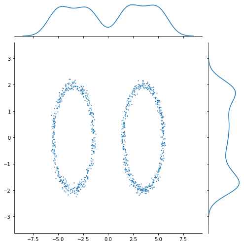

Trace plot
----------

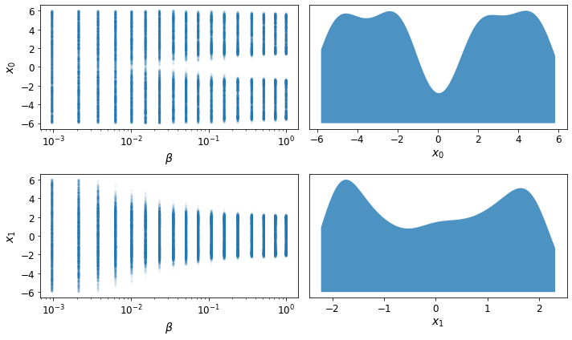

Run plot
--------

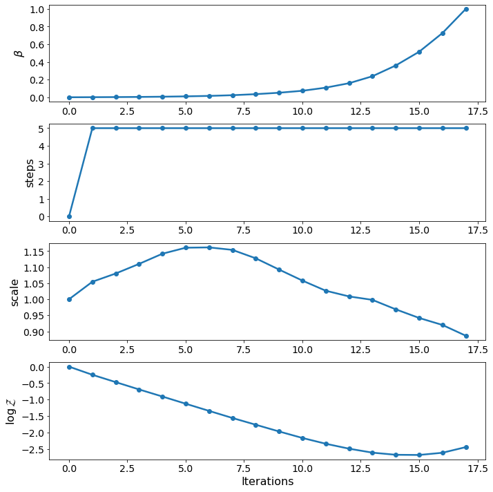

Double Gaussian
===============

The ``Double Gaussian`` distribution consists of a Gaussian mixture in 10D in
which the two components are well separated from each other and one of them is
twice the size of the other.

2D marginal posterior
---------------------

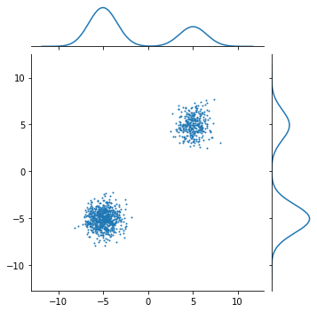

Trace plot
----------

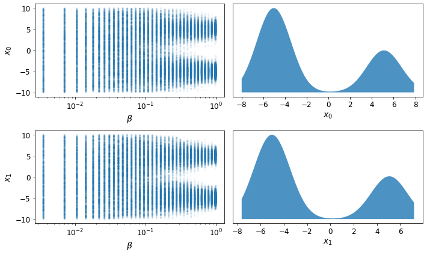

Run plot
--------

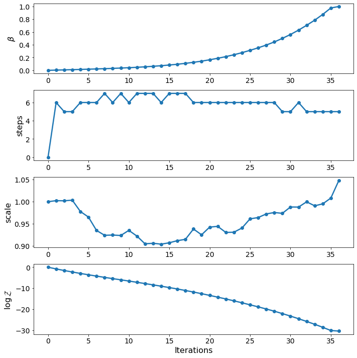

Rosenbrock
==========

The ``Rosenbrock`` distribution is one of the most infamous sampling and optimisation
targets. The reason is clear and it is its highly warped geometry. Here we sample from
this very challenging target in 10D extremely efficiently.

2D marginal posterior
---------------------

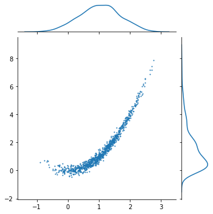

Trace plot
----------

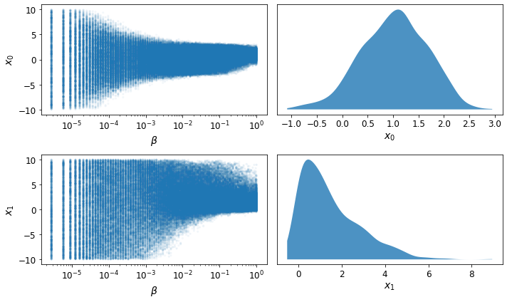

Run plot
--------

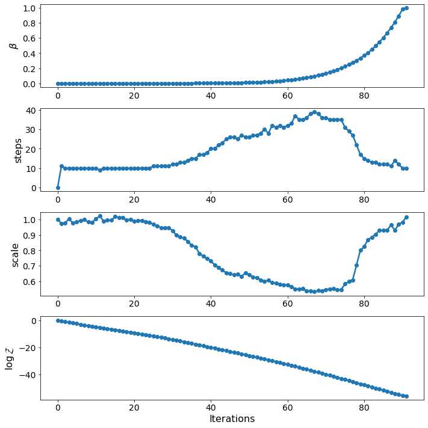

Funnel
======

``Neal's funnel`` as it is most commonly known is a very challenging target distribution
that makes sampling from it using common MCMC methods such as Hamiltonian Monte Carlo a
very difficult task. ``pocoMC`` manages to sample very efficiently by internally decorrelating
its geometry, thus simplifying the problem.

2D marginal posterior
---------------------

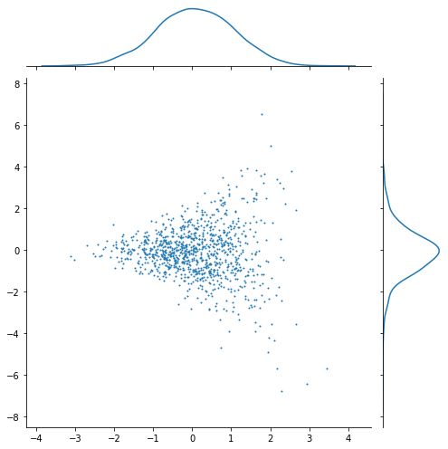

Trace plot
----------

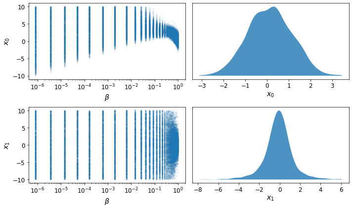

Run plot
--------

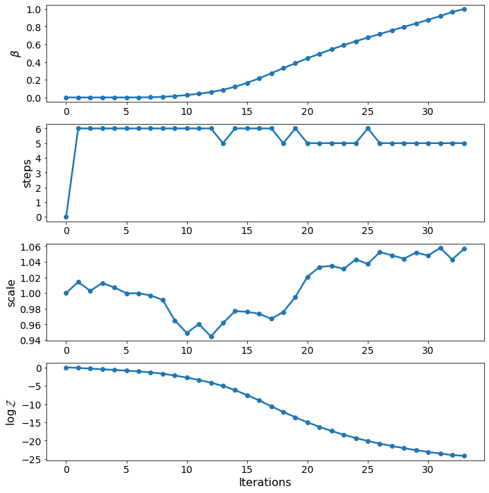